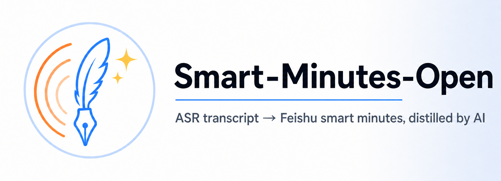
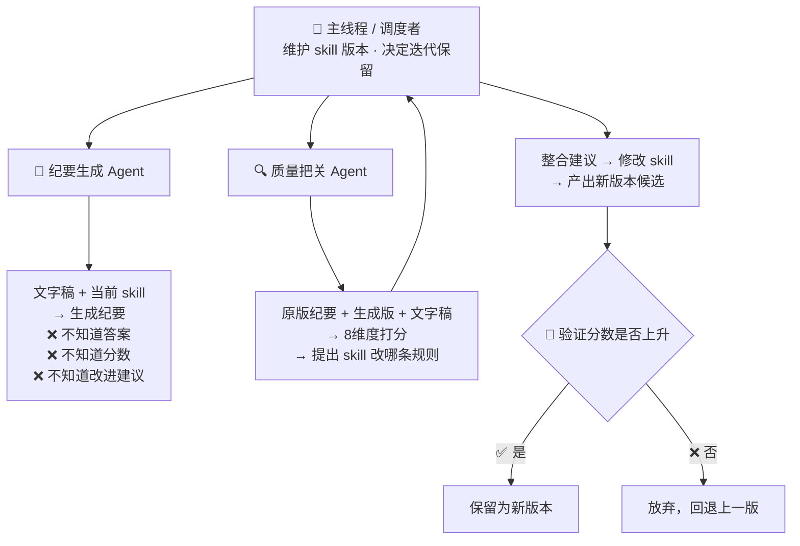

<div align="center">

<!-- ════════════════════════════════════════════════════════════ -->
<!--  Banner Hero 区域                                            -->
<!-- ════════════════════════════════════════════════════════════ -->



<br/>

**无需飞书 AI 会员，把会议文字稿变成飞书「智能纪要」级专业文档。**

<!-- 多语言链接 -->
[📖 English](./README.md) · [📖 中文](./README.zh.md) · [🚀 Quick Start](./SETUP.md)

<!-- Shields 多行布局 -->
<p>
  <a href="https://github.com/YunfanGoForIt/Smart-Minutes-Open/stargazers">
    
  </a>
  <a href="https://github.com/YunfanGoForIt/Smart-Minutes-Open/network/members">
    
  </a>
  <a href="https://github.com/YunfanGoForIt/Smart-Minutes-Open/issues">
    
  </a>
  <a href="LICENSE">
    
  </a>
</p>
<p>
  
  
  
  
</p>

<p>
  <em>"飞书 AI 会员太贵额度太少，我蒸馏了一个平替。"</em><br/>
  <em>"Feishu's AI plan is pricey and quota-tight — so I distilled an open replacement."</em>
</p>

</div>

---

## 🌟 一句话介绍

> **Smart-Minutes-Open** 是一个 Claude Code Skill，将会议/通话 ASR 文字稿生成为与飞书「智能纪要」同等风格的完整文档：
> **画板速览 + 要点梳理 + 待办/智能章节/关键决策/金句时刻/相关链接**，可选回写为飞书知识库子文档。
>
> **无需飞书 AI 会员。只需一篇文字稿。**

---

## 🚀 快速开始

```bash
# 1. 安装飞书 CLI
npm install -g @larksuite/cli
lark-cli config init

# 2. 安装本 skill
# 把本目录放到 Claude Code 的 ~/.claude/skills/smart-minutes-open/ 下

# 3. 提取文字稿
lark-cli minutes +detail --minute-tokens <token> --transcript

# 4. 触发生成
# 在 Claude Code 中把文字稿路径发过去，说"生成智能纪要"即可
```

📖 详细初始化步骤见 [`SETUP.md`](SETUP.md)

---

## 📦 输入 / 输出

| 输入 | 输出 |
|------|------|
| 一篇 ASR 文字稿（`transcript.txt`，含发言人区分与时间戳） | `智能纪要.md` — 完整纪要文档 |
| 可选：妙记 token + minutes 子域名 | `画板.json` + `画板.png` — 开头可视化画板 |
| 可选：回写配置（知识库父节点） | 飞书知识库子文档（需回写模式） |

---

## 📂 项目结构

```
Smart-Minutes-Open/
├─ SKILL.md                          ← 入口：快速决策 + 执行步骤
├─ SETUP.md                          ← 首次初始化引导
├─ README.md                         ← 本文件（项目总览 + 蒸馏方法论）
├─ references/                       ← 详细规范（按需读取，渐进式加载）
│  ├─ output-structure.md            ← 输出文档总体结构
│  ├─ whiteboard.md                  ← 画板 — DSL JSON / 渲染 / 写入
│  ├─ summary-notes.md               ← 要点梳理 — grid 多列结构化
│  ├─ todos.md                       ← 待办 — 复选框 + cite
│  ├─ smart-chapters.md              ← 智能章节 — 时间戳分段
│  ├─ key-decisions.md               ← 关键决策 — 三要素 / 主次
│  ├─ golden-quotes.md               ← 金句时刻
│  ├─ related-links.md               ← 相关链接
│  ├─ quality-checklist.md           ← 全局质量要求 + 自检清单
│  └─ writeback.md                   ← 回写到飞书知识库
└─ scripts/
   └─ build_writeback.py             ← 生成产物 → 飞书回写 markdown 转换
```

> 💡 **渐进式加载**（Progressive Disclosure）：`SKILL.md` 保持精简（~75 行），各章节规范拆分到 10 份独立文档。模型生成某章节时只需读对应 reference，不必一次加载全部规范——既省上下文，又便于单独维护。

---

## 🛠️ 依赖

本 skill 依赖 [lark-cli](https://github.com/orgs/larksuite/packages) 及以下官方技能：

| 技能 | 用途 |
|------|------|
| `lark-shared` | 认证与权限 |
| `lark-whiteboard` | 画板查询与编辑 |
| `lark-minutes` | 妙记文字稿提取 |
| `lark-wiki` | 知识库节点管理 |
| `lark-doc` | 飞书文档编辑 |

不做内联复制，避免与官方技能内容重复、维护脱钩。

---

## 🏆 这个 Skill 是怎么炼成的：用"机器学习训练"的思路写 Skill

> [!IMPORTANT]
> 这个 Skill 不是手写出来的，而是**蒸馏**出来的——用一套类似 ML 训练流程的方法，让模型自己 Loop 迭代优化，直到生成质量逼近飞书原版。

我们用 **13 轮迭代 + 双 Agent 隔离打分** 的方法论，把飞书原版纪要作为"标准答案"，像训练模型一样把规则逐步优化。分数不会说谎：

### 📊 评分演进

| 指标 | 分数 | 可视化 |
|------|------|--------|
| 初始版本 | 74 | ███████████████░░░░░ |
| 第 3 轮 | 78 | ████████████████░░░░ |
| 第 6 轮 | 86 | █████████████████░░░ |
| 第 8 轮 | 88 | █████████████████▌░░ |
| **训练集最终** | **86-88** | **█████████████████▌░░** |
| **测试集（未参与改进）** | **~85.8** | **█████████████████▍░░** |
| **验证集（盲测）** | **81** | **████████████████░░░░** |

> 🎯 **测试集 85.8 + 验证集 81** — 证明没有过拟合，真实场景可用。

---

## 🧠 核心方法论：双 Agent 隔离 + 分数驱动



> [!TIP]
> **为什么要隔离？** 防止"对着答案做题"。如果生成 Agent 能看到飞书原版纪要或上一轮的改进建议，它就会直接抄答案、迎合评分，而不是真正内化规则。隔离后，分数上升才真实反映 skill 在变好。

### 类机器学习的数据划分

| 集合 | 数量 | 用途 | 类比 |
|------|------|------|------|
| **训练集** | 11 篇 | 每轮选 1 篇做"改进样本" | 训练集 |
| **测试集** | 4 篇 | 每 ~3 轮全量打分，防止过拟合 | 测试集 |
| **验证集** | 2 篇 | 无原版，最终盲测，模拟真实场景 | 验证集 |

### 关键突破（分数驱动下被逼出来的）

1. **会议性质先分流** — 讲座类细切（每 3-5 分钟一章）、讨论类按大主题合并、圆桌类按嘉宾成章
2. **画板从文字 grid 升级为 DSL JSON + 渲染自检** — 真正可渲染的飞书画板
3. **占位符规范化 + 防幻觉** — 飞书链接子域名用占位符禁造假域名、术语不确定时保留音译
4. **关键决策分主次 + 分享类建议性决策** — 1 条主决策完整三要素 + N 条其他简列

> [!NOTE]
> 这套方法论本身（双 Agent 隔离 + 类 ML 数据划分 + 分数驱动迭代）是**可复用**的——换一个领域，只要能拿到"原版答案 + 输入样本"，就能用同样的流程蒸馏出对应的 skill。

---

## 📐 8 维度评分体系

| 维度 | 权重 | 说明 |
|------|------|------|
| 画板 | 20% | 可视化结构图质量 |
| 要点梳理 | 20% | 多列结构化速览 |
| 智能章节 | 15% | 分段逻辑与粒度 |
| 关键决策 | 15% | 主次决策、三要素完整性 |
| 待办 | 10% | 复选框 + cite 准确度 |
| 格式还原度 | 10% | 与飞书原版风格一致性 |
| 忠实度与幻觉 | 5% | 无虚构域名、无过度演绎 |
| 金句时刻 | 5% | 关键语录捕获 |

---

## 🤝 贡献

欢迎 Issue / PR！如果你有真实会议文字稿 + 飞书原版纪要，可以帮我们扩展数据集，进一步提升泛化能力。

## 📄 许可

MIT © 作者（详见 [LICENSE](LICENSE)）

---

<div align="center">

**觉得有用？点个 ⭐ 支持一下！**

<a href="https://github.com/YunfanGoForIt/Smart-Minutes-Open">
  
</a>

</div>

<!-- Star History -->

## ⭐ Star History

[](https://star-history.com/#YunfanGoForIt/Smart-Minutes-Open&Date)
